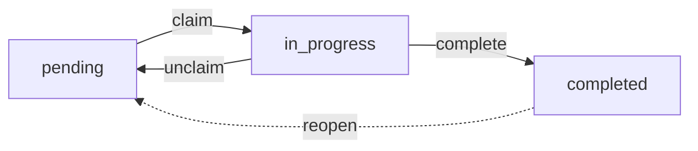

# maestro

Maestro is a local-first conductor for multi-agent software engineering. It gives you one CLI and one on-disk state model for missions, features, assertions, handoff launches, checkpoints, memory, and project context so separate agent sessions can collaborate without a server, database, or background daemon.

It is designed for a workflow where a human operator coordinates multiple terminals, while Maestro keeps the shared state disciplined and inspectable.

## Why Maestro

- Shared state lives on disk in `.maestro/`, not in chat history.
- Missions break work into milestones, features, and validation assertions.
- Native handoff launches build a self-contained markdown brief and start a fresh Codex, Claude, or Hermes run from the current repo state.
- Memory commands turn corrections and learnings into reusable guidance.
- Mission Control gives you a read-only TUI and JSON snapshots of current state.
- The runtime stays local-first: filesystem, git, config, and terminal tools.

## System Map


Maestro is the shared state layer in the middle. The operator and fresh agent runs both go through the CLI, the CLI persists shared state locally, and Mission Control projects that same state without mutating it.

## What Maestro Is Not

- It is not a hosted orchestration service or remote agent platform.
- It is not tied to a single model vendor or harness.
- It does not require a database, queue, or network API to work.

The human operator is the bridge between terminals. Maestro is the shared state layer underneath that workflow.

## Two Working Loops

Maestro has two related but separate operating modes:

| Use missions when you need... | Use tasks when you need... |
|---|---|
| A planned multi-step effort with milestones, assertions, checkpoints, and handoff launches. | A lightweight blocker graph for the daily queue. |
| A durable brief for a fresh agent run. | Fast `ready`, `claim`, `update`, and blocker management. |
| Reviewable artifacts under `.maestro/missions/<mission-id>/`. | Repo-tracked task state under `.maestro/tasks/tasks.jsonl`. |

If you only remember one distinction: `mission` is for planned execution; `task` is for the day-to-day queue.

## Core Concepts

| Concept | Purpose |
|---|---|
| Mission | The top-level unit of work with a lifecycle such as `draft`, `approved`, or `executing`. |
| Milestone | A phase within a mission. Milestones can act as work phases or validation gates. |
| Feature | A concrete piece of work assigned to an agent type, with verification steps and optional dependencies. |
| Assertion | A validation target tied to a feature. Assertions are updated to `passed`, `failed`, `blocked`, or `waived`. |
| Handoff | A persisted launch record plus markdown brief for starting a fresh Codex, Claude, or Hermes session from current mission or repo context. |
| Task | A Claude-style blocker-graph work item for the daily loop; lives at `.maestro/tasks/tasks.jsonl` independent of missions. |
| Reply | An agent's structured outcome record for a feature, optionally gated by behavioral principles. |
| Principle | A behavioral rule injected into agent prompts and scored against replies. Stored at `.maestro/principles.jsonl`. |
| Memory | Corrections, learnings, and compiled guidance that feed back into future agent prompts. |
| Checkpoint | A timestamped mission snapshot you can save and later restore. |
| Bundle | A portable `.mission.tar.gz` archive of a mission plus its artifacts for review or transfer. |
| Mission Control | A read-only dashboard for previewing mission state interactively or as JSON. |

## Mission Control Preview

Mission Control gives you a read-only terminal dashboard over the current Maestro state.


## How Work Flows


The loop is deliberately simple: define work, optionally inspect the feature brief, launch a fresh handoff, update progress, validate the outcome, and checkpoint before sealing the milestone.

## Installation

### Requirements

- [Bun](https://bun.sh/)
- Git
- A local agent harness in another terminal, such as Codex, Claude Code, or Hermes

### Install From Release

Install the latest published Maestro binary:

```bash
curl -fsSL https://raw.githubusercontent.com/ReinaMacCredy/maestro/main/scripts/install.sh | bash
```

Install a specific published release:

```bash
MAESTRO_VERSION=<version> curl -fsSL https://raw.githubusercontent.com/ReinaMacCredy/maestro/main/scripts/install.sh | bash
```

After installation, refresh to the latest published release with:

```bash
maestro update
```

### Build From Source

```bash
bun install
bun run build
```

This produces the compiled binary at `./dist/maestro`.

### Install Locally

```bash
bun run release:local
command -v maestro
maestro --version
```

If you also want to initialize global config and inject supported agent instruction blocks:

```bash
maestro install
```

This syncs bundled Maestro skills into Codex, Claude Code, Hermes, and the shared AgentSkills root when those targets are available. See [Provider Registry and Skills](docs/providers.md) for roots, diagnostics, and external skill installs.

`./dist/maestro` is the fresh repo build. `maestro` on your `PATH` is the installed local binary.

## Quick Start

### 1. Initialize a project

```bash
maestro init
```

This creates the local `.maestro/` workspace for the current repository, seeds default policy files, and writes `.maestro/MAESTRO.md` — a read-order compass that points fresh agents at the right files (this compass → root `AGENTS.md` → `.maestro/tasks/NOW.md` → `maestro status --json` → policies → specs).

### 2. Create a mission plan file

`mission create` expects a JSON plan file. A minimal example:

```json
{
  "title": "Add authentication",
  "description": "Ship the first authentication slice",
  "milestones": [
    {
      "id": "plan",
      "title": "Planning",
      "description": "Define the implementation approach",
      "order": 0,
      "kind": "work",
      "profile": "planning"
    },
    {
      "id": "implement",
      "title": "Implementation",
      "description": "Build and verify the feature",
      "order": 1,
      "kind": "work",
      "profile": "implementation"
    }
  ],
  "features": [
    {
      "id": "auth-plan",
      "milestoneId": "plan",
      "title": "Plan the auth flow",
      "description": "Define the login shape, risks, and acceptance criteria",
      "agentType": "codex-cli",
      "verificationSteps": [
        "Review the proposed flow with the team"
      ]
    },
    {
      "id": "auth-impl",
      "milestoneId": "implement",
      "title": "Implement the auth flow",
      "description": "Build the first working authentication slice",
      "agentType": "codex-cli",
      "dependsOn": [
        "auth-plan"
      ],
      "verificationSteps": [
        "Run build",
        "Run targeted tests",
        "Verify the login flow manually"
      ],
      "fulfills": [
        "auth-login-works"
      ]
    }
  ]
}
```

### 3. Create and approve the mission

```bash
maestro mission create --file plan.json
maestro mission list
maestro mission approve <mission-id>
```

### 4. Inspect the current feature brief (optional)

```bash
maestro feature list --mission <mission-id>
maestro feature prompt <feature-id> --mission <mission-id> --out agent-prompt.md
```

This writes the prompt to `agent-prompt.md` and also stores it under `.maestro/missions/<mission-id>/agents/<feature-id>/prompt.md`. `maestro handoff` does not require this step, but it is useful when you want to inspect the current feature context before launching a fresh agent run.

### 5. Launch a handoff

Launch a fresh Codex run for the next implementation slice:

```bash
maestro handoff \
  "Implement auth-impl for mission <mission-id> and run the listed verification steps before stopping" \
  --agent codex
```

Launches are detached by default. Maestro persists the handoff under `~/.maestro/handoff/<id>/` (a single global store) and returns the launch record with the prompt path, log path, target directory, linked task id, and agent details.

Useful variants:

```bash
maestro handoff "Review auth-impl before merge" --agent claude --worktree auth-review
maestro handoff "Finish auth-impl and wait for the result" --agent codex --wait --json
maestro handoff "Run a Hermes pass over auth-impl" --agent hermes --wait --json
maestro handoff pickup --id <handoff-id> --json
```

### 6. Track progress, validate, and seal

```bash
maestro feature update auth-impl --mission <mission-id> --status in-progress
maestro feature update auth-impl --mission <mission-id> --status review
maestro validate show --mission <mission-id>
maestro validate update auth-login-works --mission <mission-id> --result passed --evidence "bun test"
maestro checkpoint save --mission <mission-id>
maestro milestone seal implement --mission <mission-id>
```

## Handoffs

`maestro handoff "<task>"` builds a self-contained markdown brief from the current repo state plus the linked task continuation, then launches a fresh Codex, Claude, or Hermes run. Every launch is persisted under `~/.maestro/handoff/<id>/` (a single global store) so the operator can inspect exactly what was sent and what the child process printed. Handoffs created in one working directory are visible from any other. Prompt-only packets can be picked up from any working directory, but task-linked packets must be picked up from their source project unless you explicitly pass `maestro handoff pickup --standalone`.

### What a launch contains

A launch record always includes:

- `id`, `agent`, and `model`
- `status`: `launching`, `launched`, `completed`, or `failed`
- `targetDir`: the directory handed to the external agent
- `promptPath`, `outputPath`, and the exact launched `command`
- task and takeover metadata such as `refs.taskId`, `createdByAgent`, `pickedUpByAgent`, and `consumedAt`
- optional `worktree` metadata when `--worktree` is used
- optional `pid` and `exitCode`, depending on detached vs `--wait` mode

The prompt itself is stored separately as markdown. Maestro always renders the same sections:

- `Task`
- `Context`
- `Relevant Files`
- `Current State`
- `What Was Tried`
- `Decisions`
- `Acceptance Criteria`
- `Constraints`

### How prompt context is chosen

- If exactly one actionable feature exists in the active mission, Maestro anchors the brief to that mission, milestone, feature, assertions, agent prompt or report artifacts, and the current git state.
- Otherwise it falls back to repository context: current branch, recent commits, and changed files.
- If the handoff is linked to an active task continuation, Maestro injects the saved `currentState`, `nextAction`, active decisions, and recent local timeline into the prompt before launch.
- When `--worktree` is used, Maestro creates the sibling worktree first and appends that worktree path and branch information to the `Constraints` section.

### Launch status flow


- Default mode returns as soon as the child process is started and records status `launched`.
- `--wait` blocks until the agent exits and records `completed` or `failed`.
- `--json` prints the persisted launch record for automation or debugging.
- `handoff pickup` atomically consumes a packet on first pickup. Prompt-only packets can be consumed anywhere; task-linked packets resume their linked task only when pickup happens from the source project, unless `--standalone` is passed.

### Typical commands

Default Codex launch:

```bash
maestro handoff \
  "Implement auth-impl for mission <mission-id> and verify the touched surface area" \
  --agent codex
```

Claude launch in a sibling worktree:

```bash
maestro handoff \
  "Review auth-impl for regressions and missing tests" \
  --agent claude \
  --worktree auth-review
```

Foreground automation-friendly launch:

```bash
maestro handoff \
  "Finish auth-impl and return only after the tests pass" \
  --agent codex \
  --wait \
  --json
```

Hermes launch:

```bash
maestro handoff \
  "Run a focused Hermes implementation pass" \
  --agent hermes \
  --wait \
  --json
```

Use `--model` to override the agent default (`gpt-5.4` for Codex, `opus` for Claude; Hermes only receives `--model` when explicitly provided), `--name` to label the launch, and `--base` when you need a specific base branch for a worktree handoff. Use `maestro handoff pickup` to consume a packet, and pass `--standalone` when you intentionally want only the prompt without resuming a linked task.

## Task System

Tasks are Maestro's lightweight, mutable issue graph for the daily queue. A task answers "what do I do next?"; a mission answers "what are we building?" Tasks live in `.maestro/tasks/tasks.jsonl`, are repo-tracked, and review like regular diffs.

### Lifecycle



- `pending` tasks sit in the queue.
- `in_progress` tasks are claimed by exactly one session.
- `completed` tasks are locked; edits or re-runs require `task reopen`, which restores the task and its continuation summary.
- Legacy statuses (`open`, `blocked`, `deferred`, `closed`) still parse from older state files and collapse to `pending` or `completed` on read.

Every task carries a `type` (`task`, `bug`, `feature`, `epic`, `chore`), a `priority` (`P0`-`P4`, default `P2`), freeform `labels`, optional `parentId`, ownership metadata (`assignee`, `claimedAt`, `lastActivityAt`), optional `contractId`, and an optional `receipt` (`summary`, `surprise`, `verifiedBy`) captured at completion.

### Dependencies and blocking

Blocking is symmetric and stored on both sides. Each task has a `blockedBy` list of prerequisites and a `blocks` list of dependents. Declaring that `A` blocks `B, C` atomically updates all three tasks.

```bash
maestro task block <id> <blockedTaskIds...>
maestro task unblock <id> <blockedTaskIds...>
maestro task create "..." --blocked-by <ids>
```

Rules enforced by the domain layer:

- A task is **ready** only when every entry in its `blockedBy` is `completed` (or missing from the store). `task ready` returns exactly the pending, unblocked, unassigned set, ranked `P0`/`P1` first and then by creation time.
- Status moves into `in_progress` or `completed` fail with a blocker error when any prerequisite is still open.
- The retired `task deps add|remove` verbs now error and point to `task block` / `task unblock`.

### Discovery

| Command | Returns |
|---|---|
| `maestro task status` | Hybrid board: compact active/ready/blocked lists plus expanded dependency tracks. |
| `maestro task ready` | Pending, unblocked, unassigned tasks, `P0`/`P1` first. |
| `maestro task mine` | Tasks claimed by the active session. |
| `maestro task stuck` | `in_progress` tasks idle past `--older-than` (default `4h`). |
| `maestro task similar <id>` | Tasks that look alike by title, completion reason, receipt text, and linked contract text. |
| `maestro task list` | Full filter set: `--status`, `--priority`, `--type`, `--label`, `--parent`, `--assignee`, `--limit`. Add `--tracks` for headline-only output. |

### Status view

`maestro task status` renders a hybrid operator board. Simple one-task tracks render as compact rows under `ACTIVE`, `READY`, or `BLOCKED`. Multi-step tracks expand only when dependency structure matters: blocked steps or ready steps that unlock downstream work. If a ready task unlocks blocked downstream work, a one-line `next:` hint appears under the header.

```text
$ maestro task status
tasks: 42 open | 13 active | 5 ready | 16 blocked | 5 blocked tracks
next: epic/desktop-path-native-ghostty / Phase 0: verify env and stock paseo desktop dev flow (9 unblocks)

ACTIVE
  o chore/update-global-agents-md        Update global AGENTS.md guidance
  o chore/check-maestro-task-dependency  Check maestro task dependency support against beads-rust
  o chore/map-full-parallel-agent        Map full parallel-agent safety picture in maestro
  o fix/fix-all-reviewed-regressions     Fix all reviewed regressions
  + 9 more

DEPENDENCY TRACKS

epic/desktop-path-native-ghostty
  · Phase 0: verify env and stock paseo desktop dev flow
      ready, 9 unblocks
  ! Phase 1: build pinned GhosttyKit xcframework
      blocked by Phase 0: verify env and stock paseo desktop dev flow
  ! Phase 2: scaffold ghostty-bridge N-API addon
      blocked by Phase 1: build pinned GhosttyKit xcframework
  + 7 more

epic/test-batch-non-code
  · Test batch: inspect ready queue
      ready, 2 unblocks
  · Test batch: inventory pending handoffs
      ready, 2 unblocks
  ! Test batch: draft cleanup notes
      blocked by Test batch: inspect ready queue, Test batch: inventory pending handoffs
  ! Test batch: close out temporary test set
      blocked by Test batch: draft cleanup notes

READY
  · implement/review-last-four-commits      Review last four commits from 44d5f670 to e55384bf
  · implement/implement-continuation-layer  Implement continuation layer

BLOCKED
  ! implement/investigate-regression            blocked by implement/scope-diff-history-feat
  ! implement/inspect-changed-files-efficiency  blocked by implement/load-review-instructions-diff
  ! implement/report-concise-findings-2         blocked by implement/inspect-changed-files-efficiency
```

Flags:

| Flag | Effect |
|---|---|
| `--all` | Include completed tasks (rendered with the `v` glyph). |
| `--track <slug-or-id>` | Restrict output to one track. |
| `--json` | Emit a structured projection (`{ header, tracks[], orphans[], tasksById }`) for tooling. `header` includes `open`, `active`, `ready`, `pending`, `blocked`, and `blockedTracks`. |

**Render shape.** The default view keeps solo/non-dependent work compact and expands only dependency tracks. `ACTIVE` shows at most four rows before `+ N more`; `READY`, `BLOCKED`, and dependency tracks are capped separately. Blocked rows render `blocked by <slug-or-id>` inline, while blocked steps inside dependency tracks render the blocker on the next line. Completed blockers are marked `(done)`.

Color is auto-detected: `NO_COLOR=1` or a non-TTY pipe disables ANSI codes. Tracks (top-level tasks) carry a slug like `implement/<kebab>` (verbs: `implement | fix | chore | spike | epic`) which doubles as a human-friendly id — `task show implement/foo` and `task update implement/foo --status ...` work the same way `tsk-XXX` does.

#### Backfilling legacy tasks

Tasks created before slugs landed have no slug and render with their bare `tsk-<id>` as the header. To bulk-derive slugs from titles:

```bash
maestro task backfill-slugs                  # dry-run; prints what would change
maestro task backfill-slugs --apply          # write the slugs
maestro task backfill-slugs --apply --limit 20
maestro task backfill-slugs --rederive --apply  # refresh auto-derived slugs after the algorithm changes
```

Derivation drops English stop-words ("and", "of", "in", ...), drops pure-hex tokens (commit shas) and digit-only tokens, caps at 4 significant words, and never truncates mid-word — so the result is short and scannable.

Backfill is display-only and bypasses the completion + ownership locks (slugs don't affect runtime state), so it works on completed and currently-claimed tasks. By default it refuses to overwrite an existing slug; `--rederive` opts in to overwriting (use it when the derivation algorithm has changed).

### Ownership and claim

Claiming is exclusive and session-scoped. Session IDs come from the `sessionDetection` config (Claude Code out of the box) or `--session <id>` when scripting.

```bash
maestro task claim <id>
maestro task claim <id> --busy-check        # refuse if this session already owns open work
maestro task claim <id> --force             # steal from another session
maestro task claim <id> --stale-after 4h    # auto-release a dead owner's stale claim
maestro task unclaim <id>                   # in_progress demotes to pending
maestro task release-owned <sessionId>      # release everything a session held
maestro task heartbeat <id>                 # bump lastActivityAt without other edits
```

`task update <id> --status in_progress` auto-claims an unassigned task for the current session, provided the session has no other open work (or `--force` is passed). This preserves the invariant that a session owns at most one in-flight task at a time.

### Batch planning

Agents can stage a whole queue upfront from one JSON file. References between tasks use a batch-local `name` slot that resolves to real ids inside a single atomic write.

```bash
maestro task plan --file plan.json
maestro task plan --file - < plan.json
maestro task plan --file plan.json --start scaffold    # auto-claim the named task
maestro task plan --file plan.json --dry-run           # validate without writing
```

```json
{
  "batchId": "auth-slice",
  "tasks": [
    { "name": "scaffold", "title": "Scaffold auth module", "type": "chore", "priority": 2 },
    { "name": "tests", "title": "Add login tests", "blockedBy": ["scaffold"] },
    { "title": "Wire login route", "blockedBy": ["scaffold", "tests"], "labels": ["auth"] }
  ]
}
```

### Resumable continuation

Every task has a durable, on-disk continuation record that tells the next agent where work stands. It is the source of truth for resume across sessions, across agents, and across context compaction. Standalone handoff packets are the transfer artifact; the continuation is the state.

Two files back each task:

- `.maestro/tasks/continuations/active/<taskId>.json` -- live summary. Moves to `completed/<taskId>.json` at `task update --status completed` and returns to `active/` on `task reopen`.
- `.maestro/tasks/local-history/<taskId>.jsonl` -- append-only event log (per-machine).

Summary fields: `currentState`, `nextAction`, `keyDecisions`, `activeAgent`, `lastActiveAt`. Event kinds: `snapshot`, `decision`, `next_action_set`, `blocker_set`, `handoff_created`, `handoff_picked_up`, `agent_takeover`, `task_completed`, `task_reopened`.

#### Three ways work resumes

1. **Same session, chat intent.** Maestro installs Claude Code hooks that hydrate the active continuation into the agent's context with no CLI call:
   - `SessionStart` injects a short pointer when an active task exists: id, title, status, last-active timestamp, and a nudge to say `continue` or `resume`.
   - `UserPromptSubmit` watches for these exact phrases (case- and punctuation-insensitive) and expands them into the full resume payload (current state, next action, active decisions, recent timeline) before the model sees the prompt:
     - `continue`
     - `continue work`
     - `resume`
     - `resume work`
     - `pick up where we left off`
     - `resume where we left off`
     - `resume from where we left off`
   - `PreCompact` preserves the continuation in the compacted summary so resume survives a context reset.

   These are plain chat intents, not Maestro CLI commands.

2. **Different agent, handoff pickup.** `maestro handoff pickup [--id <handoffId>]` consumes one open packet atomically. Prompt-only packets can be picked up from any working directory. Task-linked packets are project-anchored: from the source project, pickup force-claims the linked task for the current session, moves it to `in_progress`, transfers any contract ownership, rewrites the continuation summary with a `Resumed from handoff ...` prefix, and records `agent_takeover` + `handoff_picked_up` events. From another project, Maestro errors with the source path and a concrete `cd ... && maestro handoff pickup ...` command. Pass `--standalone` to intentionally consume the packet without resuming the linked task.

3. **Manual inspection.** `maestro task show <id>` prints the raw task and continuation state for offline review.

#### Keep the continuation fresh while working

```bash
maestro task update <id> \
  --current-state "Tests pass locally; rebased on main" \
  --next-action "Open PR and request review" \
  --add-decision "Use bcrypt over argon2 for parity with legacy" \
  --remove-decision "Use JWTs in localStorage"
```

Refresh when current state or next action changes, when a load-bearing decision or constraint changes, or when blockers appear or clear.

### Contracts

A contract is a machine-checked agreement attached to a task: what to touch, what to avoid, and what "done" means. At completion, Maestro diffs `claimedAtCommit..HEAD` and renders a verdict.

Lifecycle: `draft` -> `locked` or `amended` -> `fulfilled` or `broken`, with `discarded` as an early-exit from `draft`. A closed contract can be reopened alongside its task.

```bash
maestro task contract new <taskId> --editor "$EDITOR"   # or --from template.yaml
maestro task contract edit <ref>
maestro task contract lock <ref>                         # freeze scope + claim commit
maestro task contract amend <ref>                        # record a post-lock change
maestro task contract show <ref>
maestro task contract list
maestro task contract verdict <ref>                      # preview without closing
maestro task contract discard <ref>                      # draft only
maestro task contract reopen <ref>                       # after fulfilled/broken
maestro task contract criteria mark <ref> <criterionId> --evidence "bun test"
maestro task contract criteria add <ref> "New criterion text"
maestro task contract criteria remove <ref> <criterionId>
```

A contract records:

- `intent` -- one-sentence goal.
- `scope` -- `filesExpected`, `filesForbidden`, optional `maxFilesTouched` cap.
- `doneWhen[]` -- explicit criteria, each `manual` or `receipt-hint`, each markable with evidence.
- `claimedAtCommit` -- git HEAD captured at lock; the verdict diffs against it.
- `configSnapshot` -- strictness, overlap policy, anchor-rebase fallback, and stale-reclaim policy in effect at lock time.
- `ownershipHistory` -- transfers from `claim --force` reclaims and `handoff pickup`.

Completion gating: `task update --status completed` against a task with a locked contract closes the contract, renders a verdict, and fails completion when the verdict is broken and either `contracts.strict=true` is set or `--strict` is passed. Use `--no-contract` to complete without a contract when `contracts.default=required`.

Relevant config (`.maestro/config.yaml`):

```yaml
contracts:
  default: prompt              # required | prompt | optional
  strict: false                # block completion on broken verdict
  overlapPolicy: fail          # fail | annotate (active contract scope overlap)
  rebaseFallback: best-effort  # best-effort | fail (when claimedAtCommit is missing)
  defaultMaxFilesTouched: ~    # integer cap or unset
  staleReclaimContractPolicy: inherit  # inherit | block (when taking over a stale claim)
```

### Task storage

```text
.maestro/tasks/
├── tasks.jsonl                 # authoritative task graph (repo-tracked)
├── contracts/                  # per-task locked contracts and verdicts (repo-tracked)
├── contract-templates/         # reusable YAML drafts for `contract new --from`
├── continuations/              # per-task resume summaries + event logs
├── batches/                    # batch plan manifests
├── candidates/                 # captured work candidates awaiting promotion
└── local-history/              # per-machine audit log (ignored)
```

`tasks.jsonl`, `contracts/`, and `principles.jsonl` are intentionally repo-tracked so the queue and its policies review like any other code change. Local histories and candidate piles stay per-machine. Bound their growth with:

```bash
maestro task prune                       # keep the most recent 500 entries per kind
maestro task prune --keep 100 --candidates-only
maestro task prune --continuations-only --dry-run
maestro task prune --all                 # purge both piles
```

## Evidence

Maestro has a lightweight logbook for recording verifiable outputs tied to a task. Use it to document commands that ran, their exit codes, and optional manual notes — before or after completing work.

Evidence rows are stored under `.maestro/evidence/` (gitignored, per-machine) and stamped with a `WitnessLevel` that captures how trustworthy the claim is: `witnessed-by-maestro` for Maestro-invoked commands, `agent-claimed-locally` for evidence the agent self-reported, and `agent-claimed-and-not-reproducible` for manual notes.

```bash
# Record a command run
maestro evidence record --task tsk-aaaaaa --command "bun test" --exit 0

# Record with duration and optional log path
maestro evidence record --task tsk-aaaaaa --command "bun run build" --exit 0 --duration 12345 --log ./build.log

# Record a manual note
maestro evidence record --task tsk-aaaaaa --kind manual-note --note "Verified UI on staging"

# List evidence for a task
maestro evidence list --task tsk-aaaaaa

# Show one evidence row
maestro evidence show evd-xxxxxx
```

Evidence rows are linked to a task id and optionally to a contract criterion via `--criterion <id>`. Run `maestro evidence record --help` for the full flag set.

## Trust Substrate

Maestro's trust substrate is a stack of opt-in layers that turn agent claims into deterministic, auditable, gated decisions. Each layer is independently useful; together they compose. Contracts narrow the scope of work, the Trust Verifier checks the diff against that scope, the Verdict gates completion on witnessed evidence, CI makes the verdict authoritative, and the optional layers above (auto-merge, deploy safety, cross-task conflict) extend the same primitives outward.

The sections below cover each layer in turn. They are presented in the order a team typically adopts them, but every layer past contracts is opt-in and can be enabled independently.

## Contracts and the Trust Verifier

This is the foundation. A contract pins down what a task is allowed to touch; the Trust Verifier checks the diff against that contract. Three behaviors define this layer:

1. **Plan proposes a contract.** During `maestro-plan`, the plan must include a `proposed_contract` with `allowed_files`, `forbidden_paths`, `done_when` criteria, and an `amendment_budget`. Plan-time proposals are not amendments — they seed the contract that gets locked when the agent claims the task.

2. **Agent works within scope; amends on genuine discovery.** When work uncovers a file that lies outside the locked contract scope, the agent must amend before touching it:

   ```bash
   maestro contract amend --task <id> --add-path src/new-file.ts --reason "discovered at runtime"
   ```

   Each amendment writes a new versioned contract snapshot and a `contract-amended` Evidence row. The budget defaults are `max_amendments: 3`, `max_paths_per_amendment: 5`. Amendments are versioned Evidence and never silent edits.

3. **Agent verifies before completing.** `maestro task verify` runs the Trust Verifier against the current diff and the locked contract:

   ```bash
   maestro task verify --task <id>
   ```

   The verifier runs 6 checks in parallel: scope adherence, lockfile parity, generated-file parity, sensitive-path policy, commit metadata, and secrets-in-diff. Findings are printed with severity (`info`, `warn`, `error`). Exit codes: `0` when no `error` findings, `1` when at least one `error` finding, `2` when the task has no locked contract (warn — use `maestro task contract new` to create one).

### CLI surface

```bash
# Versioned contract inspection and amendment
maestro contract show --task <id>
maestro contract show --task <id> --version <n>
maestro contract amend --task <id> --add-path <path> --reason "<why>"
maestro contract amend --task <id> --remove-path <path> --reason "<why>"
maestro contract history --task <id>

# Trust Verifier
maestro task verify --task <id>
maestro task verify --task <id> --base <git-ref>
maestro task verify --task <id> --json

# Mission Spec (acceptance criteria and non-goals)
maestro spec show --mission <id>
maestro spec edit --mission <id>
```

### Policy files

`maestro init` bootstraps two policy files committed under `.maestro/policies/`:

- `sensitive-paths.yaml` — glob list; paths matching these globs trigger `checkSensitivePaths` findings. See `docs/sensitive-paths-defaults.md` for the 8 default globs and guidance on extending or relaxing them.
- `owners.yaml` — three role lists (`policy_approver`, `ratchet_approver`, `sensitive_waiver`). See `docs/owners-yaml-format.md` for the schema reference.

## Verdicts and Risk Class

The verdict layer turns a verifier run into a deterministic gating decision. After `maestro task verify`, an agent requests a verdict that produces one of four outcomes:

| Verdict | Meaning |
|---|---|
| `PASS` | All acceptance criteria are met with evidence at or above the required witness level for the effective risk class. Completion is unblocked. |
| `FAIL` | Evidence is present but insufficient: a criterion is unmet, or the evidence witness level is below the autopilot policy threshold. |
| `HUMAN` | Criteria are met but the effective risk class or autopilot policy requires a human reviewer before the task can be sealed. |
| `BLOCK` | A hard blocker is active: broken contract, `critical` risk class with no human signoff, or a policy loosening still in its 30-day soak window. |

### Witness levels

Every Evidence row carries a `witness_level` that captures how trustworthy the claim is. The ladder, strongest to weakest:

1. `witnessed-by-maestro` — Maestro itself ran the command and captured the result.
2. `witnessed-by-ci` — A trusted CI gate ran the command and posted the result back.
3. `agent-claimed-locally` — The agent self-reported a local run; Maestro did not observe it. Default for schema v1 evidence rows.
4. `agent-claimed-and-not-reproducible` — A manual note; cannot be reproduced. Weakest level.

The Risk Engine demotes `PASS` to `HUMAN` if any evidence row's witness level is below the threshold required by the effective autopilot policy for the derived risk class.

See `docs/witness-levels.md` for the full reference.

### Risk class

The Risk Engine derives a risk class from deterministic diff signals and takes the higher of agent-proposed vs Maestro-derived. An agent can never lower the derived class. The four levels are `low`, `medium`, `high`, and `critical`. See `docs/risk-class-derivation.md` for the signal-to-class mapping table.

### ProofMap

`maestro task proof --task <id>` produces a per-criterion coverage map: for each acceptance criterion in the linked Spec, it shows which Evidence rows satisfy it and at what witness level.

### Asymmetric policy editing

Policy tightenings (stricter rules, lower budgets) take effect immediately. Policy loosenings (relaxed rules, higher budgets) soak for 30 days before becoming effective. Pending loosenings accumulate in `.maestro/policies/.pending-loosenings.json` (gitignored). Use `maestro policy pending` to inspect.

### CLI surface

```bash
# Verdict
maestro verdict request --task <id>           # exit 0=PASS 1=FAIL 2=HUMAN 3=BLOCK
maestro verdict request --task <id> --json
maestro verdict show --task <id>
maestro verdict show --task <id> --version <id>

# ProofMap
maestro task proof --task <id>
maestro task proof --task <id> --json

# Policy inspection
maestro policy check --task <id>
maestro policy pending
```

### Policy files

`maestro init` bootstraps three additional policy files under `.maestro/policies/`:

- `risk.yaml` — extends or tightens the default signal-to-class mapping. Absent means defaults apply.
- `autopilot.yaml` — per-risk-class required witness level and auto-pass eligibility.
- `release.yaml` — release-gate rules (e.g., minimum witness level required before a release commit is stamped).

See `docs/policy-format.md` for the schema reference for all five policy files.

## The Pre-Claim Loop

The pre-claim loop closes the inner agent loop: the agent runs plan, implement, verify, and verdict steps without human intervention; humans still review and merge. The cycle is enforced by the tools, not by convention.

### The pre-claim ritual

Before claiming any non-trivial task done, the agent runs this ordered loop:

1. **Intake** — run `maestro intake --paths <paths>` to classify the work as `tiny`, `normal`, or `high-risk` before writing code. The output drives the next step (patch directly, batch-create tasks, or build a Spec + threat-model).
2. **Plan** — write a plan file and run `maestro plan check` to catch problems before code is written.
3. **Implement** — write code and record evidence after each verification command.
4. **Verify** — run `maestro task verify` and address every `error` finding.
5. **ProofMap** — run `maestro task proof` and confirm every acceptance criterion is covered.
6. **Verdict** — run `maestro verdict request` and branch on the exit code.

The canonical source for this ritual is the `maestro-verify` bundled skill — read it when in doubt about the verification protocol.

### Intake

`maestro intake` is a deterministic plan-time risk classifier. It returns a lane and a recommended next step before code is written, using the same risk-class derivation rules as the Verdict layer.

| Lane | Trigger | Next step |
|---|---|---|
| `tiny` | 0–1 risk flags, no hard gate | Patch directly, run validation, close with reason. |
| `normal` | 2–3 risk flags, no hard gate | Create a task via `maestro task plan` and follow the standard pre-claim loop. |
| `high-risk` | Any hard gate, or 4+ flags | Build a Spec with acceptance criteria, plus a `threat-model` Evidence row when the diff intersects sensitive paths. |

Hard gates (any one promotes to `high-risk`): `auth`, `authz`, `data-model`, `audit-security`, `external-systems`. The classifier auto-detects flags from the intended file paths against the effective risk policy and sensitive-path globs; declared flags are merged on top.

```bash
maestro intake --paths src/auth/session.ts --flag auth
maestro intake --paths src/foo.ts,src/bar.ts --json
```

Exit code is always 0; agents react to `lane`, `derivedRiskClass`, `threatModelRequired`, and `recommendedNextStep` in the output.

### Plan-check

`maestro plan check` evaluates a plan file against the locked contract and spec before any code is written. It catches three classes of problems:

- **`scope-widens`** — the plan intends to touch files outside `contract.scope.filesExpected`. Resolve by narrowing the intended files or amending the contract before coding.
- **`missing-proof`** — an acceptance criterion from the Spec has no entry in the plan's `proofSet`. Every criterion needs a planned proof strategy.
- **`risk-class-too-low`** — the plan's declared `riskClass` is lower than what the intended file set triggers. Raise it to match.

The verb always exits 0. Findings in the output must be resolved before implementation begins. A clean plan-check does not guarantee a passing verdict; it means the plan is internally consistent.

```bash
maestro plan check --task <id> --plan-file ./plan.yaml
maestro plan check --task <id> --plan-file ./plan.yaml --json
```

### AI Reviewer Evidence

Agents can record reviewer findings as structured evidence via `maestro evidence record --kind ai-review`. Three reviewer kinds are available: `bug` (correctness, edge cases, regressions), `security` (auth, input validation, secrets, injection), and `architecture` (boundary violations, coupling, abstraction misuse).

Any `error`-severity finding raises the effective risk class by one notch. A `security`-reviewer `error` always lifts to `critical`. A clean review (zero `error` findings) never lowers the deterministic baseline derived from diff signals.

See `docs/ai-reviewer-protocol.md` for the finding schema, confidence semantics, and recording guidance.

### Threat-model evidence

When the diff intersects security-relevant sensitive paths, the Verdict is `HUMAN` with reason `threat-model-required` unless a `threat-model` Evidence row is present. Produce the threat-model document and record it before requesting a verdict:

```bash
maestro evidence record --task <id> --kind threat-model \
  --threat-model-file ./threat-model.json
```

See `docs/threat-model-format.md` for the schema (assets, threatCategories, mitigations, residualRisk) and examples.

### Cost budgets

Contracts can declare cost limits: `maxRetries`, `maxWallClockSeconds`, and `maxTokens`. When any limit is exceeded, run-state at `.maestro/runs/<task-id>/state.json` (gitignored) is marked exhausted and the next `verdict request` returns `BLOCK` (exit 3) with reason `cost-budget-exhausted`. Check consumption at any time:

```bash
maestro task budget --task <id>
maestro task budget --task <id> --json
```

`retryCount` increments automatically on each `FAIL` or `HUMAN` verdict.

### Mission Control autopilot view

In mission mode, Mission Control gains an `autopilot` screen that projects the current verify/verdict state across all active tasks in the mission. Use `maestro mission-control --preview autopilot --size 120x40 --format plain` to inspect it non-interactively.

### CLI surface

```bash
# Plan-check
maestro plan check --task <id> --plan-file <path>
maestro plan check --task <id> --plan-file <path> --json

# Cost-budget inspection (read-only, always exits 0)
maestro task budget --task <id>
maestro task budget --task <id> --json

# AI Reviewer evidence
maestro evidence record --task <id> --kind ai-review \
  --reviewer <bug|security|architecture> \
  --findings '<inline-json-or-path>' \
  --confidence <0-1>

# Threat-model evidence
maestro evidence record --task <id> --kind threat-model \
  --threat-model-file <path>
```

## CI Integration

Local Maestro is advisory; CI Maestro is authoritative. The PR check status posted by `maestro ci verify` is the merge gate.

1. Bootstrap your repo with `maestro setup` — the maestro-setup skill installs `.github/workflows/maestro-verify.yml` from its bundled template (when `.github/` exists).
2. Pin the Maestro binary version in the workflow (default: latest tagged release).
3. Open a PR. GitHub Actions runs `maestro ci verify`, which runs Trust Verifier, ingests CI job results as `witnessed-by-ci` Evidence, computes the Verdict, and posts a GitHub Check.
4. Merge when the check is green. Use `maestro verdict show --pr <n>` locally to inspect the latest verdict for a PR (looked up by current HEAD tree SHA).

Verdicts are bound to (pr, tree_sha), so squashes survive but force-pushes to a different tree invalidate them.

See `docs/ci-integration.md` for the full reference (workflow template, env contract, witness ingestion, troubleshooting).

## Auto-Merge

When all 8 eligibility predicates pass, `maestro merge auto` triggers `gh pr merge --auto` without further human intervention. Auto-merge applies to roughly 5–15% of merged PRs in practice — only those where the diff is small-scope, fully CI-witnessed, and the autopilot policy explicitly opts in for the relevant risk class.

### Opt-in

Auto-merge is disabled for all risk classes by default. Opt in per class in `.maestro/policies/autopilot.yaml`:

```yaml
autoMergeAllowed:
  low: true
  medium: true
  high: false
  critical: false
```

### Eligibility predicates

All 8 must pass for `merge auto` to trigger. In canonical check order:

| Code | Condition |
|---|---|
| `verdict-not-pass` | Verdict decision must be `PASS` |
| `auto-merge-class-disabled` | `autoMergeAllowed.<riskClass>` must be `true` in `autopilot.yaml` |
| `evidence-witness-too-weak` | All gating evidence rows must be at `witnessed-by-ci` or stronger |
| `forbidden-paths-touched` | Diff must not intersect `contract.scope.filesForbidden` |
| `sensitive-paths-untouched-without-waiver` | If diff touches sensitive paths, a `verdict-override` waiver must exist |
| `rollback-not-witnessed` | When the spec declares a rollout plan or a `deploy-readiness` row exists, a successful `rollback-exercised` Evidence row at `witnessed-by-ci` or stronger must exist |
| `review-ack-missing` | HUMAN verdicts at `>=medium` risk require a `review-ack` Evidence row |
| `spec-score-below-threshold` | If a Spec is linked, its quality score must be 1.0 |

### CLI shapes

```bash
# Check eligibility and trigger if eligible
maestro merge auto --pr <number> --task <id> [--base <ref>] [--repo <owner/name>] [--json]

# Record override waiver (requires sensitive_waiver authorization in owners.yaml)
maestro verdict override --task <id> --pr <number> --reason "<text>" [--verdict <id>] [--base <ref>]

# Record human review acknowledgement (for HUMAN verdicts at >=medium risk)
maestro review ack --task <id> --verdict <id> --criterion "<text>" [--criterion "<text>" ...]
```

Exit codes for `merge auto`: 0 = eligible and triggered, 1 = ineligible (reasons printed).

See `docs/auto-merge-eligibility.md` for the full predicate reference and "Why isn't my PR auto-merging?" troubleshooting. See `docs/override-flow.md` for override authorization, audit trail, and no-silent-pass guarantees.

## Deploy Safety

Deploy Safety is opt-in. Producing `deploy-readiness` and `runtime-signal` Evidence does not by itself flip Verdict semantics; teams wire the new Evidence into `policies/risk.yaml` if they want it to gate.

### Spec schema: `runtime_signals` and `rollout_plan`

The spec adds two optional fields: `runtime_signals` (array of `RuntimeSignal` — name, provider, query, threshold) and `rollout_plan` (feature flag name, canary stages, rollback command). Older specs forward-migrate at read time with empty arrays and no rollout plan.

### `maestro deploy gate`

Runs four checks and records a `deploy-readiness` Evidence row. Exits 0 when all checks pass, 1 when any fail.

| Check | Passes when |
|---|---|
| `feature_flag` | `Spec.rollout_plan.feature_flag` is a non-empty string |
| `canary_plan` | `Spec.rollout_plan.canary.stages` has at least one stage |
| `rollback` | A successful `rollback-exercised` Evidence row at `witnessed-by-ci` or stronger exists |
| `owner` | `owners.yaml.deploy_approver` has at least one entry |

`deploy gate` does NOT mutate the Verdict. Teams add a `deploy-readiness` signal to `policies/risk.yaml` if they want it to block a PR.

### `maestro deploy rollback`

Runs the provided shell command, records a `rollback-exercised` Evidence row, and exits 1 if the command fails. The witness level is `witnessed-by-ci` in CI and `witnessed-by-maestro` locally — both satisfy the rollback check in `deploy gate`.

### `maestro runtime check`

Queries each signal declared in `Spec.runtime_signals` via the configured provider (Prometheus). Records one `runtime-signal` Evidence row per signal. Exit code is always 0; `pass=false` rows are advisory unless wired into risk policy.

Provider base URL precedence: `--provider-base-url` flag → `MAESTRO_PROMETHEUS_URL` env → `http://localhost:9090`.

### `owners.yaml` — `deploy_approver` role

`owners.yaml` has a fourth role: `deploy_approver`. The list is checked by `deploy gate` (owner check). See `docs/owners-yaml-format.md` for the full schema. CI Maestro's PR-author check also verifies that the committer is not self-approving their own deploy.

### CLI shapes

```bash
maestro deploy gate --task <id> [--base <ref>] [--json]
maestro deploy rollback --task <id> --command <cmd> [--json]
maestro runtime check --task <id> [--provider-base-url <url>] [--json]
```

See `docs/deploy-gate.md` for the full check enumeration, `Spec.rollout_plan` reference, and troubleshooting. See `docs/runtime-monitoring.md` for the `RuntimeMonitorPort` reference and Prometheus adapter guide.

## Cross-Task Conflict and Trust Benchmarks

Two features extend the trust substrate horizontally — one across PRs, one across edge cases.

### Cross-task conflict detection

`maestro ci verify` checks whether other open PRs touch any of the same file paths as the current PR. When overlap is detected, it records a `kind=cross-task-conflict` Evidence row at `witnessed-by-ci` and passes it to the Risk Engine. The Risk Engine raises the effective risk class one tier per signal (capped at `critical`; multiple conflict rows still produce only a one-tier raise total).

Detection is file-path-level: a path counts as overlapping when it appears in both this PR's changed-file list and at least one other open PR's changed-file list. The check is non-fatal on API errors — a failed `gh api` call logs a warning and skips the record without failing the verify step.

See `docs/cross-task-conflict.md` for the port/adapter/use-case flow, payload schema, and troubleshooting.

### Trust benchmark corpus

`tests/e2e/trust-benchmark/` is an end-to-end regression corpus of 9 scenarios drawn from a master edge-case list of 32. The corpus covers: out-of-scope edits, generated-file drift, sensitive-path violations, security-thin diffs, amendment creep, proof not tied to criteria, rebase/squash verdict identity, deploy-gate decision authority, and PR self-weakening. Each scenario includes a positive assertion (mitigation fires) and a negative assertion (mitigation does not fire without the trigger).

```bash
bun test tests/e2e/trust-benchmark/
```

See `docs/trust-benchmark.md` for the full scenario table, fixture pattern, and how to add new scenarios.

### Roadmap

The following capabilities are not in this release and will ship when teams ask maestro to learn from incidents: autopsy generator, `maestro ratchet` review/approve/sunset CLI, N≥2 broad-promotion guard for ratchet rules, and sunset/decay machinery.

## MCP Server

Maestro ships a Model Context Protocol (MCP) server that exposes its core verbs to MCP-aware agent runtimes. Agents call `maestro_task_create`, `maestro_evidence_record`, `maestro_verdict_request`, and so on as structured tools instead of shelling out to the CLI and parsing text. The server is the same maestro binary, run with `maestro mcp serve` over stdio.

### Tool surface

14 tools across 5 surfaces, each a 1:1 wrapper around an existing maestro use case:

| Surface | Tools |
|---|---|
| Task | `maestro_task_list`, `maestro_task_get`, `maestro_task_create`, `maestro_task_claim`, `maestro_task_complete`, `maestro_task_block`, `maestro_task_unblock` |
| Evidence | `maestro_evidence_record`, `maestro_evidence_list` |
| Contract | `maestro_contract_show`, `maestro_contract_amend` |
| Verdict | `maestro_verdict_show`, `maestro_verdict_request` |
| Policy | `maestro_policy_check` |

`maestro_task_list` and `maestro_evidence_list` are paginated (`limit`/`offset` in, `pagination: { total, limit, offset, hasMore }` out). Every tool declares both a strict `inputSchema` (unknown fields error rather than being silently dropped) and an `outputSchema` mirroring the success-path `structuredContent`. Failures set `isError: true` with a stable `{ code, message, hints }` payload — clients branch on `code` (`TASK_NOT_FOUND`, `ALREADY_COMPLETED`, `OWNERSHIP_CONFLICT`, `CYCLE_DETECTED`, `CONTRACT_NOT_FOUND`, …).

### Auto-configure on install

`maestro install` and `bun run release:local` register the MCP entry with each supported runtime by shelling out to the runtime's own CLI (`claude mcp add -s user`, `codex mcp add`). Detection is CLI-on-`PATH`: a runtime whose CLI is not on `PATH` is silently skipped, so the install does not litter configs onto machines that don't have the runtime.

The entry lands in the canonical file each runtime actually reads:

| Runtime | Config file |
|---|---|
| Claude Code (user scope) | `~/.claude.json` (top-level `mcpServers.maestro`) |
| Codex | `~/.codex/config.toml` (`[mcp_servers.maestro]` table) |

### CLI surface

```bash
maestro mcp serve                                  # stdio transport, default
maestro mcp serve --project-root /abs/path         # override project root detection
maestro mcp check                                  # verify installed binary + runtime configs
maestro mcp check --json
```

`mcp serve` reads JSON-RPC over stdin and writes responses to stdout; logs and errors go to stderr to keep the protocol channel clean. `mcp check` reports `[ok]`, `[stale]`, or `not configured` per runtime and exits `1` when the binary is missing.

### Project scoping

The server walks up from its working directory looking for `.maestro/`. To override, set `MAESTRO_PROJECT_ROOT` in the entry's `env` block (or pass `--project-root` when running standalone). The session id reported on writes is auto-detected from `MAESTRO_SESSION_ID`, `CLAUDECODE_SESSION_ID`, or `CODEX_THREAD_ID`, falling back to `<user>@<host>`.

See [`docs/mcp-server.md`](docs/mcp-server.md) for the full tool and error-code reference, and [`docs/mcp-setup.md`](docs/mcp-setup.md) for the manual configuration path and troubleshooting.

## Common Commands

| Command | Use it when you want to... |
|---|---|
| `maestro init` | Create local project state. |
| `maestro install` | Initialize global config and inject supported agent instruction blocks. |
| `maestro update` | Upgrade the local binary to the latest release and refresh agent instruction blocks. |
| `maestro doctor` | Check whether the local environment is configured correctly. Includes harness-drift checks for empty mission feature directories and oversized root docs. |
| `maestro providers list` / `maestro providers doctor` | Inspect runtime and skill-target provider configuration. |
| `maestro skills list` / `maestro skills install <source>` | Discover, inspect, install, remove, and sync AgentSkills-compatible skills. |
| `maestro status` | Inspect the current Maestro state quickly. |
| `maestro mission create --file plan.json` | Create a mission from a plan file. |
| `maestro feature prompt <feature-id> --mission <mission-id>` | Generate the next agent prompt. |
| `maestro feature update <feature-id> --mission <mission-id> --status <status>` | Advance a feature through `pending`, `assigned`, `in-progress`, `review`, `done`, or `blocked`. |
| `maestro reply write <feature-id>` | Record an agent reply (outcome + optional report) for a feature. |
| `maestro handoff "<task>" --agent <agent>` | Build a markdown brief from current repo or mission context and launch a fresh agent run. |
| `maestro handoff pickup [--id <handoff-id>] [--standalone]` | Consume one open handoff packet. Prompt-only packets work anywhere; task-linked packets resume only from their source project unless `--standalone` is passed. |
| `maestro handoff "<task>" --worktree [slug] --wait --json` | Launch in a sibling worktree, wait for completion, and return structured metadata. |
| `maestro mission-control --preview` | Render a read-only dashboard preview in the terminal. |
| `maestro mission-control --json` | Get a machine-readable snapshot of mission state. |
| `maestro mission-control --render-check --size 120x40` | Validate TUI render integrity non-interactively. |
| `maestro intake --paths <list>` | Classify intended work as `tiny`, `normal`, or `high-risk` before writing code. |
| `maestro task ready` | List actionable pending tasks with no unresolved blockers. |
| `maestro task claim <id>` | Take ownership of a task for the current session. |
| `maestro task update <id> --status in_progress` / `--status completed --reason "..."` | Start or finish a task. |
| `maestro task update <id> --current-state "..." --next-action "..." --add-decision "..."` | Refresh the resumable continuation summary for the next agent. |
| `maestro task reopen <id>` | Move a completed task back to the pending queue and restore its continuation summary. |
| `maestro task block <id> <blockedTaskIds...>` | Record that one task blocks others. |
| `maestro evidence record --task <id> --command "bun test" --exit 0` | Log a command run as evidence for a task. |
| `maestro evidence record --task <id> --kind manual-note --note "..."` | Log a free-form manual note as evidence. |
| `maestro evidence list --task <id>` | List all evidence rows for a task. |
| `maestro evidence show <evidence-id>` | Show one evidence row by id. |
| `maestro mcp serve` | Start the MCP server on stdio. Agents launch this; you do not start it manually. |
| `maestro mcp check` | Verify the installed maestro binary and the canonical agent runtime config files. |
| `maestro principle list` / `principle add` | Inspect or register a behavioral principle. |
| `maestro bundle export <mission-id> --out ./review.mission.tar.gz` | Package a mission + artifacts as a portable archive. |
| `maestro bundle inspect <path>` | Print a mission bundle's manifest without extracting. |
| `maestro memory-correct <rule>` | Capture a correction that should influence future runs. |
| `maestro memory-compile` | Turn raw learnings into reusable guidance. |
| `maestro ratchet-check` | Run the regression ratchet suite. |

Run `maestro <command> --help` for full flags and examples.

## Mission Control

Mission Control is a read-only dashboard over Maestro state. It supports:

- Interactive TTY mode with `maestro mission-control`
- Single-frame previews with `maestro mission-control --preview`
- Machine-readable snapshots with `maestro mission-control --json`
- Render validation with `maestro mission-control --render-check --size 120x40`

Available preview screens include:

- `dashboard`
- `features`
- `dependencies` (mission-only)
- `config`
- `memory`
- `graph`
- `agents`
- `dispatch` (mission-only)
- `events`
- `tasks`
- `timeline` (mission-only)
- `principles`
- `help`

Aliases: `feat`, `deps`, `cfg`, `mem`, `agent`, `event`, `task`, `principle`. Mission-only screens are skipped automatically when running in home mode.

For non-interactive environments, prefer `--preview`, `--preview all`, or `--json`.

## Architecture


The codebase follows a hexagonal shape: commands stay thin, `src/services.ts` wires dependencies, use cases depend on domain rules and ports, and adapters implement those ports against the local filesystem and environment.

## Storage Model

Maestro stores project-local state in `.maestro/` and user-level defaults in `~/.maestro/`.

| Surface | Lives where | Holds |
|---|---|---|
| Project workflow state | `.maestro/` | Missions, tasks, notes, and local memory artifacts |
| User-level defaults | `~/.maestro/` | Global config, graph metadata, and the global handoff store |
| Read-only projections | Mission Control | Terminal previews and JSON snapshots over the same state |

```text
.maestro/
├── config.yaml
├── memory/
│   ├── corrections/
│   ├── learnings/
│   └── ratchet/
├── missions/
│   └── <mission-id>/
│       ├── mission.json
│       ├── assertions.json
│       ├── checkpoints/
│       ├── features/
│       └── agents/
├── tasks/
│   ├── tasks.jsonl
│   ├── contracts/
│   ├── contract-templates/
│   ├── continuations/
│   ├── batches/
│   ├── candidates/
│   └── local-history/
├── principles.jsonl
└── notes.json

~/.maestro/
├── config.yaml
├── graph/
│   └── projects.json
└── handoff/
    └── <id>/
        ├── handoff.json
        ├── prompt.md
        └── output.log
```

The design is intentionally transparent: state is inspectable, diffable, and easy to back up. `.maestro/tasks/**` and `.maestro/principles.jsonl` are intentionally repo-tracked so the daily queue and behavioral rules are reviewed like any other code change; `.maestro/missions/**` stays ignored as local orchestration artifacts. Handoff packets live in the global `~/.maestro/handoff/` store (outside the repo) so they are visible across every working directory. Legacy `.maestro/handoffs/**`, `.maestro/launches/**`, and `~/.maestro/launches/**` folders can remain on disk from earlier versions, but Maestro no longer reads them; `status` or `doctor` will warn when they are present.

## Codebase Layout

Maestro is organized as a feature-first hexagonal codebase:

- `src/features/<name>/` -- each feature is a bounded context containing its own `commands/`, `usecases/`, `domain/`, `ports/`, `adapters/`, plus a `services.ts` composition factory and `index.ts` public surface. Current features: `memory-ratchet`, `handoff` (markdown prompt building plus Codex, Claude, or Hermes launch orchestration), `notes`, `graph`, `session`, `memory`, `mission` (with `feature/`, `validation/`, `checkpoint/` subfolders and behavioral principles), `agent` (library-only; composes agent prompts and manages harness config injection), `task` (Claude-style blocker graph for the daily loop), `reply` (agent reply ingest with principle gating), and `bundle` (portable mission archive).
- `src/infra/` -- plumbing that isn't a feature: init, doctor, status, install, update, uninstall, and mission-control commands, config and git ports/adapters, and infra-owned domain types.
- `src/shared/` -- generic utilities with no domain knowledge: filesystem, YAML, shell, path safety, and output formatting under `lib/`; cross-cutting primitives like IDs and UI config under `domain/`; plus top-level `errors.ts`, `version.ts`, and `version-format.ts`.
- `src/tui/` -- read-only rendering and input for Mission Control; consumes features through their public surfaces. See `src/tui/README.md` for the contributor-oriented TUI architecture walkthrough.
- `src/services.ts` -- composition root that wires every feature's adapters into a single service object.
- `src/index.ts` -- Commander CLI entry point.

Cross-feature imports must go through `@/features/<name>`, which resolves to the feature's `index.ts`. Deep imports across feature boundaries are forbidden and enforced by `bun run check:boundaries` in CI. Two features have explicit, scoped exceptions:

- `agent` may import from `mission`, `memory`, and `handoff` through their public surfaces, because agent composes prompts from mission context, memory hints, and the native handoff launcher APIs.
- `bundle` may import from `mission`, `reply`, `handoff`, and `session` through their public surfaces, because bundle is a read-only aggregator that snapshots every mission artifact, including handoff launches, into a portable archive.

The runtime is intentionally narrow: filesystem-backed stores, git integration, config handling, and a terminal UI. There is no database adapter or network service in the main workflow.

## Development

```bash
bun run build
bun run typecheck
bun test
bun run tui:dev
bun run release:local
```

Useful verification commands for CLI and TUI work:

```bash
./dist/maestro --version
maestro --version
maestro --help
maestro mission-control --preview --size 120x40 --format plain
maestro mission-control --render-check --size 120x40
```

## Provider and Skill Targets

Maestro treats agent integrations as providers. Runtime providers can launch handoffs; skill-target providers receive Maestro-managed skills.

| Provider | Runtime | Skill target | Skills root |
|---|---:|---:|---|
| Codex | yes | yes | `$CODEX_HOME/skills` or `~/.codex/skills` |
| Claude Code | yes | yes | `~/.claude/skills` |
| Hermes | yes | yes | `~/.hermes/skills/maestro` |
| AgentSkills | no | yes | `~/.agents/skills` |

`maestro install`, `maestro update --agents-only`, and `maestro uninstall --agents-only` keep the bundled Maestro skills synced across every available skill target. The skills feature also discovers and manages external AgentSkills-compatible skills.

### Skill discovery precedence

Skill discovery is deterministic and stops at the first match. The order:

1. project `.maestro/skills`
2. project `.agents/skills`
3. repo bundled skills
4. `~/.maestro/external-skills`
5. `~/.agents/skills`
6. provider roots (`~/.claude/skills`, `~/.codex/skills`, `~/.hermes/skills/maestro`)

Collisions emit warnings. The first skill in precedence order wins.

### Provider and skill commands

```bash
maestro providers list [--json]
maestro providers doctor [provider] [--json]

maestro skills list [--scope project|user|shared|all] [--json]
maestro skills inspect <name> [--json]
maestro skills install <source> [--scope user|project|shared] [--targets all|codex,claude,hermes,agentskills]
maestro skills remove <name> [--scope user|project|shared]
maestro skills sync [--targets ...]
```

Supported install sources: local skill directory, local directory containing one or more skill directories, Git URL, GitHub shorthand (`owner/repo` or `owner/repo/path`), and HTTP `zip`/`tar`/`tgz`/`tar.gz` archive URLs. Bundled scripts inside a skill source are never executed during install.

See [Provider Registry and Skills](docs/providers.md) for the full reference, including the Hermes config mutation and security model.

## Documentation

In-depth references live under [`docs/`](docs/):

| Topic | File |
|---|---|
| Provider registry, skills, Hermes setup | [`providers.md`](docs/providers.md) |
| CI integration (`maestro ci verify`, GitHub Checks) | [`ci-integration.md`](docs/ci-integration.md) |
| Auto-merge eligibility (8 predicates) | [`auto-merge-eligibility.md`](docs/auto-merge-eligibility.md) |
| Override authorization and audit trail | [`override-flow.md`](docs/override-flow.md) |
| Risk class derivation from diff signals | [`risk-class-derivation.md`](docs/risk-class-derivation.md) |
| Witness levels (the trust ladder) | [`witness-levels.md`](docs/witness-levels.md) |
| Policy file schemas (risk, autopilot, release, sensitive paths, owners) | [`policy-format.md`](docs/policy-format.md), [`sensitive-paths-defaults.md`](docs/sensitive-paths-defaults.md), [`owners-yaml-format.md`](docs/owners-yaml-format.md) |
| AI Reviewer protocol (veto-only; raises class but never lowers it) | [`ai-reviewer-protocol.md`](docs/ai-reviewer-protocol.md) |
| Threat-model schema | [`threat-model-format.md`](docs/threat-model-format.md) |
| Cross-task conflict detection | [`cross-task-conflict.md`](docs/cross-task-conflict.md) |
| Deploy gate (4 checks + `Spec.rollout_plan`) | [`deploy-gate.md`](docs/deploy-gate.md) |
| Runtime monitoring (Prometheus adapter) | [`runtime-monitoring.md`](docs/runtime-monitoring.md) |
| Trust benchmark corpus (regression seed) | [`trust-benchmark.md`](docs/trust-benchmark.md) |
| MCP server tools and result shapes | [`mcp-server.md`](docs/mcp-server.md) |
| MCP setup for Claude Code and Codex | [`mcp-setup.md`](docs/mcp-setup.md) |

The agent-facing protocol is documented inside the bundled skills under [`skills/bundled/`](skills/bundled/). `maestro-verify` is the canonical verification protocol; `maestro-intake`, `maestro-task`, `maestro-plan`, `maestro-mission`, `maestro-handoff`, `maestro-brainstorm`, `maestro-qa`, and `maestro-setup` cross-reference it. `maestro install` syncs all of them into `~/.claude/skills/` and `~/.codex/skills/`.

## Contributing

See [CONTRIBUTING.md](CONTRIBUTING.md) for the dev loop, repository layout, conventions, required pre-PR checks, and the port → adapter → use-case → command → test pattern. For security-sensitive reports, see [SECURITY.md](SECURITY.md).

## License

[MIT](LICENSE)

